# Godot UI Template

This is a Godot 4.2 project, created with the goal to facilitate onboarding a basic UI setup for a simple game. Use it as you wish.

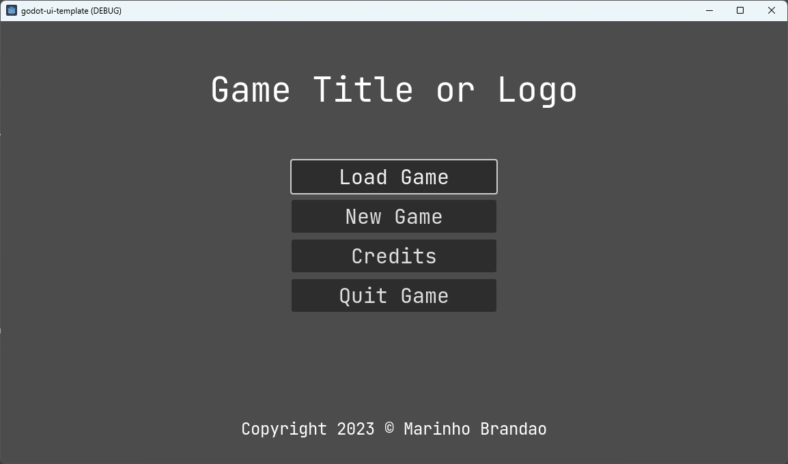

## How to use it

Download from repository https://github.com/marinho/godot-ui-template and copy folder "ui" to your game project. Then adapt it to whatever is your need.

You can either use the nodes and scripts as they are, modify them to your game or - the most recommended when possible - keep them as they are and extend your own classes by using them. This is because of Single Reponsibility Principle and separation of concerns.

## Language

This repository is fully implemented using GDScript.

### Why not C#?

- GDScript is always supported by Godot, while C# is only supported by Godot Mono
- Most Godot users are familiar to GDScript
- The functions in this repository aren't performance critical, as they are only about UI, nothing like networking or high graphic processing. So, there's no real gain on using C# for this type of features

## AutoLoads

Most features in this repository depend in one or other way on some of the autoload nodes to be enabled in the project. The order matters, in regards to ensure their dependencies and/or layers on the screen canvas.

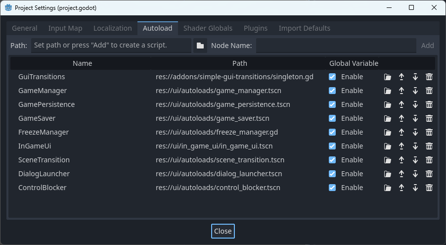

They are listed below.

### DialogLauncher

This autoload makes it easy to show an accept (alert) or confirmation dialog.

#### Properties

| Name                                   | Description                                                             |
| -------------------------------------- | ----------------------------------------------------------------------- |
| String **accept_title**                | Title for accept dialogs. Default: `"Alert"`                            |
| String **accept_button_ok_label**      | Label for OK button in accept dialogs. Default: `"Ok"`                  |
| String **confirm_title**               | Title for confirmation dialogs. Default: `"Confirmation"`               |
| String **confirm_button_ok_label**     | Label for OK button in confirmation dialogs. Default: `"Yes, I'm sure"` |
| String **confirm_button_cancel_label** | Label for Cancel button in confirmation dialogs. Default: `"No"`        |

#### Methods

| Name                              | Description                                                                      |
| --------------------------------- | -------------------------------------------------------------------------------- |
| void **confirm**(message: String) | Show confirmation dialog at the center of the screen, with Ok and Cancel buttons |
| void **accept**(message: String)  | Show accept dialog at the center of the screen, with Ok button                   |

#### Signals

| Name                                | Description                                           |
| ----------------------------------- | ----------------------------------------------------- |
| **user_confirmed**(confirmed: bool) | Called after user confirm or cancel the latest dialog |

### FreezeManager

Manages how the game freezes processes, usually necessary for pausing the game or taking physics away while doing scene transitions or cut scenes.

Freezing applies only to nodes with [Process Mode](https://docs.godotengine.org/en/stable/classes/class_node.html#class-node-property-process-mode) being pausable. The UI nodes of this repository are mostly non pausable, due to their nature.

#### Methods

| Name                                      | Description                                              |
| ----------------------------------------- | -------------------------------------------------------- |
| void **set_freezed**(to_be_freezed: bool) | Set a boolean value to define if game should be freezed. |

#### Signals

| Name          | Description                                |
| ------------- | ------------------------------------------ |
| **freezed**   | Triggered after the tree is set paused     |
| **unfreezed** | Triggered after the tree is set not paused |

### GameManager

Very basic game management singleton, used to keep what's current game and scene and changing to another one.

#### Properties

| Name                          | Description                                                                                                      |
| ----------------------------- | ---------------------------------------------------------------------------------------------------------------- |
| int **current_game_id**       | ID of current game as saved with GamePersistence. Default: `-1`                                                  |
| String **current_scene_path** | Path to currently loaded scene                                                                                   |
| String **entry_scene_path**   | Path to first scene when the game i started (i.e. entry menu). Default: `"res://ui/entry_menu/entry-scene.tscn"` |

#### Methods

| Name                                         | Description                                                                                          |
| -------------------------------------------- | ---------------------------------------------------------------------------------------------------- |
| void **set_current_game**(new_game: int)     | Set the ID of currently loaded game                                                                  |
| void **load_scene**(scene_file_path: String) | Loads a scene by its path, using SceneTransition                                                     |
| void **load_entry_scene**()                  | Returns back to entry scene - main difference to **load_scene** is that it doesn't activate InGameUI |

### GamePersistence

Responsible for file management for game states.

#### Properties

| Name                 | Description                                                                                                                                                                                 |
| -------------------- | ------------------------------------------------------------------------------------------------------------------------------------------------------------------------------------------- |
| String **file_name** | File where game state is saved. [More information in here](https://docs.godotengine.org/en/stable/tutorials/io/data_paths.html#accessing-persistent-user-data-user). Default: `"game.json"` |

#### Methods

| Name                                                                            | Description                                                                                                                                                                                                                                               |
| ------------------------------------------------------------------------------- | --------------------------------------------------------------------------------------------------------------------------------------------------------------------------------------------------------------------------------------------------------- |
| Dictionary **\_read_file_as_json**()                                            | Just read JSON file a return as a dictionary                                                                                                                                                                                                              |
| void **save_json_to_file**(json: Dictionary)                                    | Save a dictionary into the JSON file                                                                                                                                                                                                                      |
| Dictionary[] **get_saved_games**()                                              | Returns a list of saved games from JSON file                                                                                                                                                                                                              |
| Dictionary **save_new_game**(first_scene_path: String)                          | Create a new game with default values and return it                                                                                                                                                                                                       |
| Dictionary **load_game**(game_id: int)                                          | Load a saved game by its ID                                                                                                                                                                                                                               |
| Dictionary **\_override_dict**(original_dict: Dictionary, new_dict: Dictionary) | Works like [Dictionary.merge](https://docs.godotengine.org/en/stable/classes/class_dictionary.html#class-dictionary-method-merge), except that a value that is a dictionary won't replace the whole value but just the keys present in the new dictionary |

### GameSaver

Responsible for collecting current game player state and then saving it using GamePersistence. Automatic savings are possible, but disabled by default, as some games don't have it.

#### Properties

| Name                 | Description                                                                                            |
| -------------------- | ------------------------------------------------------------------------------------------------------ |
| bool **auto_saving** | When enabled, it will save current game based on the Timer node in `game_saver.tscn`. Default: `false` |

#### Methods

| Name                         | Description                                                                                           |
| ---------------------------- | ----------------------------------------------------------------------------------------------------- |
| void **save_player_state**() | Collects current game state, such as current scene and player position and save using GamePersistence |

#### Signals

| Name             | Description                    |
| ---------------- | ------------------------------ |
| **before_saved** | Triggered before game is saved |
| **after_saved**  | Triggered after game is saved  |

### SceneTransition

Responsible for a smooth transition from a scene to another, with a loading animation in between.

It relies on [Simple GUI Transitions](https://github.com/murikistudio/simple-gui-transitions) addon for handling transitions.

#### Methods

| Name                                  | Description                                                                   |
| ------------------------------------- | ----------------------------------------------------------------------------- |
| void **change_scene**(target: String) | Does a transition from current to a new scene, using FreezeManager in between |

#### Signals

| Name                   | Description                                         |
| ---------------------- | --------------------------------------------------- |
| **after_scene_change** | Triggered after a new scene is loaded to be current |

## Screens

### Entry Scene

#### Main Menu

Entry view of the game, when use can chose to load an existing game or launch a new one.

The button "Load Game" only appears if there are saved games.

#### Load a Game

List all saved games, so user can chose of them. it also shows an "X" button at the side for game deletion, with a confirmation dialog.

Limited up to a maximum of 5 games (configurable).

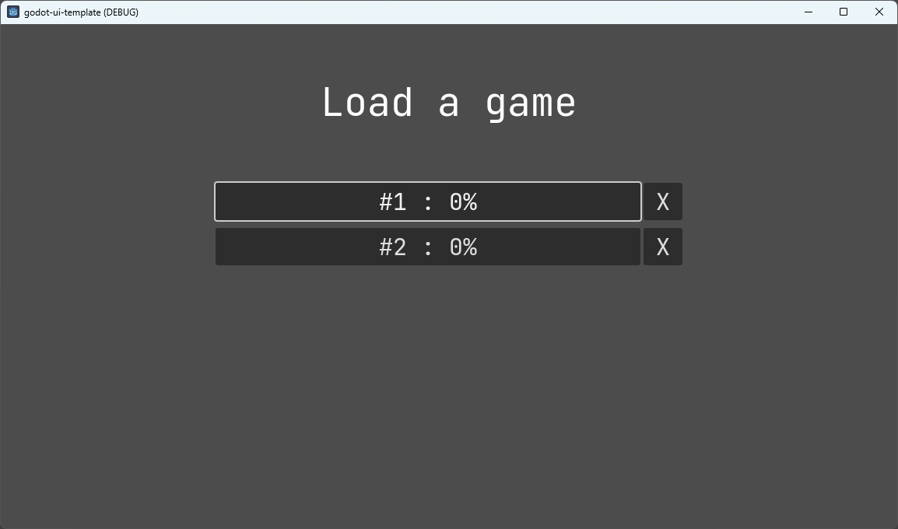

#### New Game

This is just a transition while a new game is created and launched.

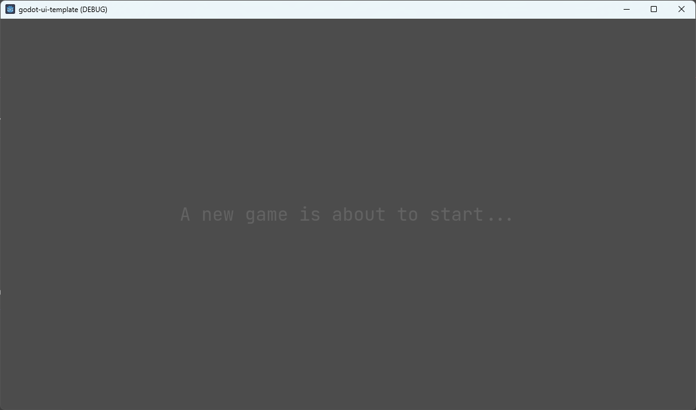

#### Credits

A auto-scrolling screen for game credits and copyrights.

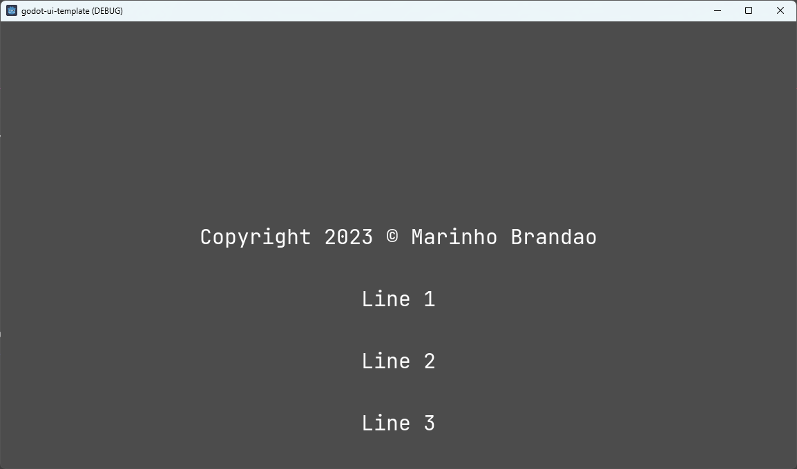

### In Game

#### Loading Transition

Used when teleporting or switching to other game scenes.

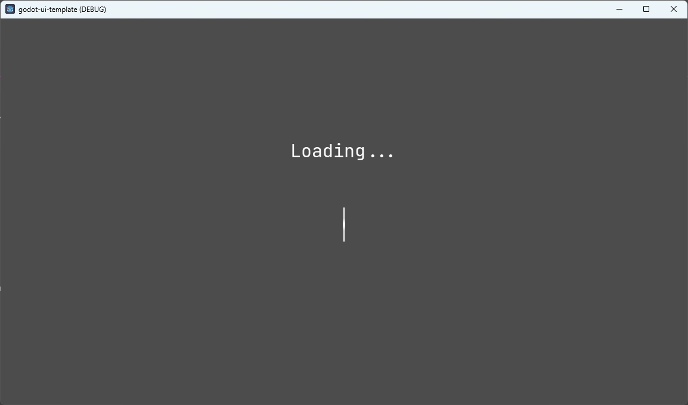

#### HUD

Always visible while game is playing and not paused. This one only just a placeholder for health/hearts bar and a score bar. Real games vary this a lot, as each of them has their own game play, so this screen might have attached controls, mana, stamina, character avatar, inventory box, a burger button for pausing and so on.

Joystick controls for mobile could be added as well, however it may be better to add a separate CanvasLayer AutoLoad on top instead.

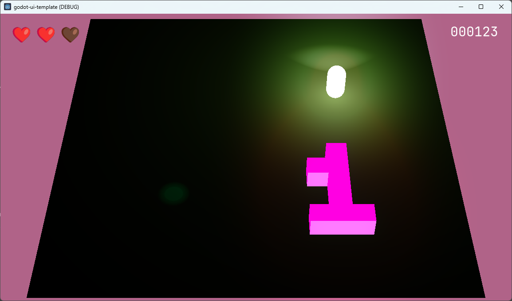

#### Pause Menu

Menu shown when user pauses the game, either just as a break or to look at settings, controls or other game aspects. I can also be fashioned for other game specific features, such as inventory, quest log or map.

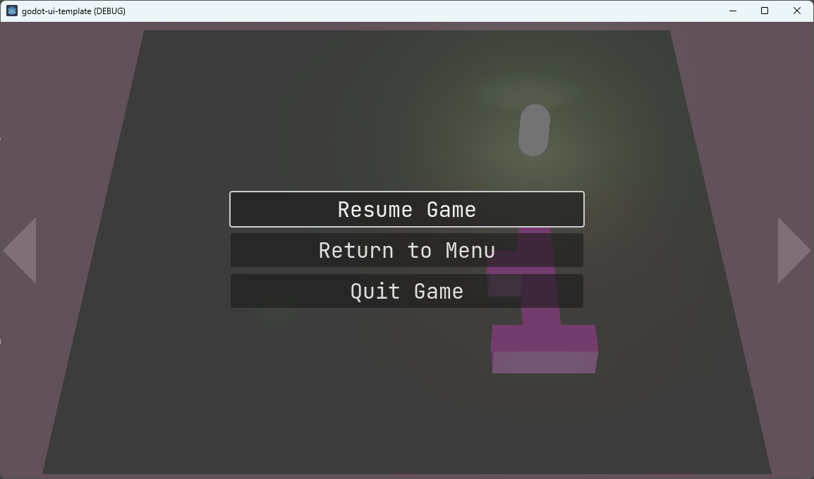

#### Pause Settings

This screen can also vary a lot from a game to another, as each of them has a different set of preferences.

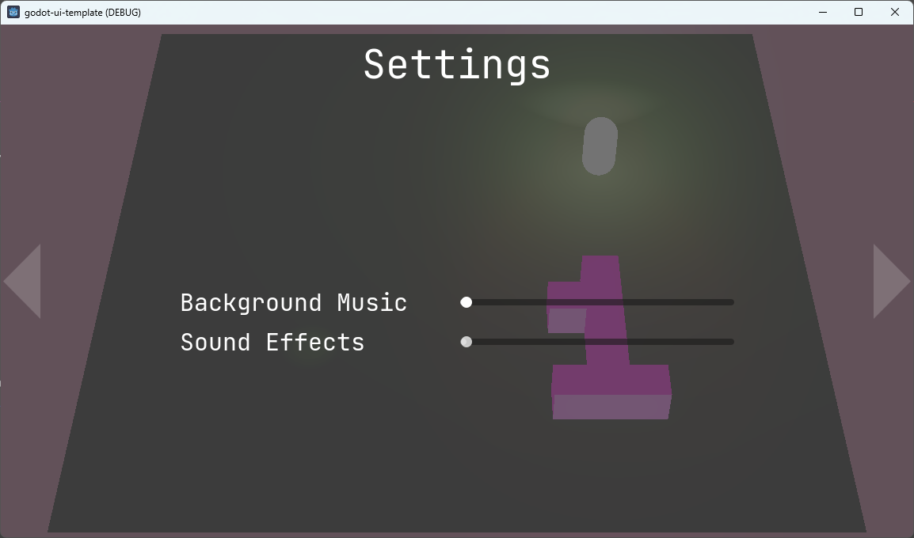

#### Pause Controls

This is a placeholder screen where you can add instructions about inputs used in the game.

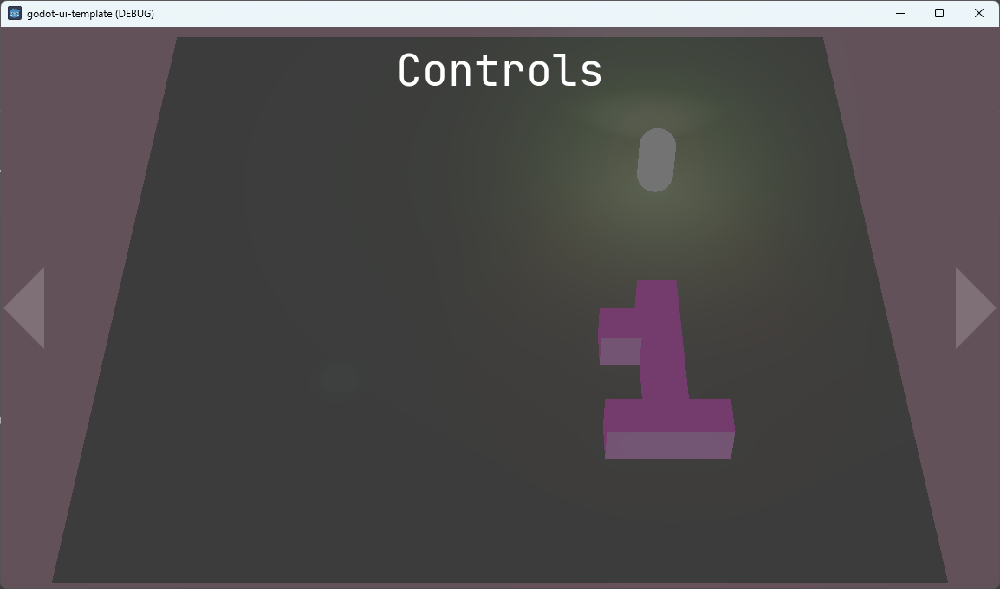

## Inputs

This template supports keyboard and XBox-like gamepads. It mostly follows Godot 4.2 defaults, but it changes the following inputs for its better usage:

| Input name      | Description                                                                                                |
| --------------- | ---------------------------------------------------------------------------------------------------------- |
| ui_page_up      | Used to switch between pages Menu, Settings and Controls in the In Game pause screen. Controls: PgUp or ZL |
| ui_page_down    | Same as above. Controls: PgDown or ZR                                                                      |
| ui_toggle_pause | Used to pause/unpause game. Controls: ESC or "+" joystick button                                           |

## Audio

Using [Kenney UI Audio](https://www.kenney.nl/assets/ui-audio) pack by default.

Add `ui/audio/ui_audio_effects_attacher.tscn` to your scene and set its root node path.

Buttons in group "UIButton" will play a sound when pressed or focused.

It can be extended by adding more AudioStreamPlayer into `ui_audio_effects_attacher.tscn` with the script `ui_audio_sound_player.gd` and attached an audioclip and respective properties in inspector, as you can see below:

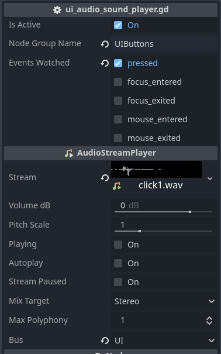

Beware it relies on Audio Bus "UI", which can be changed or created in your project.

## Theming

Using `ui/themes/base_theme.tres` for font name and font sizes.

The used font is [JetBrains_Mono](https://fonts.google.com/specimen/JetBrains+Mono?query=JetBrains+Mono) which is freely available in Google Fonts. Change it as you will in `ui/fonts/game_ui_font.tres`.

## License

Read [LICENSE](./LICENSE) file
